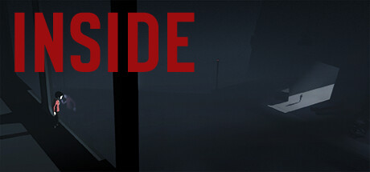

# playdead-INSIDE-FreeCam
Free camera mod for **Playdead's INSIDE** made as a Cheat Engine table. Rotate the camera any way you want, fly anywhere in the level, freeze time, explore the whole environment. No game files are modified, everything is runtime patching in memory.



---

## For players (short version)

### What it does

The normal camera in INSIDE always stays with the Boy, pointed at him from the side. This mod lets you:

- rotate the camera a full 360 degrees (look behind, from above, from the front)
- fly the camera anywhere in the level
- freeze time so you can study a moment and move the camera freely while the Boy stands still
- play with either keyboard + mouse or any Xbox-compatible controller

Boy's own controls are not touched. You still play the game normally while you move the camera.

### How to install

1. Install [Cheat Engine 7.5 or newer](https://www.cheatengine.org/downloads.php) (get it from the official site, not a fork).
2. Download `INSIDE_Gamepad_FreeCam.CT` from the [latest release](https://github.com/sashaok123/playdead-INSIDE-FreeCam/releases/latest).
3. Start INSIDE and load into an actual level (not the main menu).
4. Double-click the `.CT` file. Cheat Engine opens, attaches to the game by itself, and asks once whether to run the Lua script inside the table. Say **Yes**.
5. You are ready. Press `F1` on keyboard or `LB` on the controller to toggle the FreeCam.

### Controls

#### Keyboard and mouse

| Key | What it does |
|---|---|
| F1 | Turn FreeCam on / off |
| `` `~ `` (tilde, left of 1) | Toggle slow-motion pause |
| W / S | Move camera forward / back (along the direction you are looking) |
| A / D | Strafe camera left / right |
| Q / E | Fly camera down / up |
| Hold RMB + move mouse | Old-style aim pan (mostly replaced by the gamepad D-Pad rotation) |
| Hold R | Pull camera back to the Boy while held |
| Shift | 3x faster |
| Ctrl | 5x faster |
| Shift + Ctrl | 15x faster (fly across whole levels) |

#### Xbox controller

| Button | What it does |
|---|---|
| Left Stick | Boy moves (the game controls this, FreeCam stays out of the way) |
| Right Stick X | Strafe camera left / right |
| Right Stick Y | Fly camera down / up |
| D-Pad Left / Right | Rotate camera (full 360 degrees, no tilt) |
| D-Pad Up / Down | Fly up / down |
| LT / RT | Move camera back / forward |
| LB | Toggle FreeCam on / off (same as F1) |
| RB | Toggle slow-motion (same as tilde) |
| Hold Y | Pull camera back to the Boy |

### Tips

- Start FreeCam only when you are in a real level, not in the main menu or a loading screen. The game has to be running for a few seconds before everything is ready.
- If something goes wrong, just turn the table off in Cheat Engine. Camera goes back to normal. Nothing is broken in the save file.
- Slow-motion uses `timeScale = 0.001`, so the Boy moves about 1000 times slower. Practically frozen, but the game is still running which matters for some moments.

### Troubleshooting quick

- **"Library Injection failed" or "cannot resolve CameraBlendProbe..."**: game is still in main menu or loading. Wait for an actual level, try again.
- **Camera does not rotate with D-Pad, only shifts sideways**: the rotation patch did not apply. See the technical troubleshooting in [architecture.md](architecture.md).
- **LB / RB do nothing**: the background listener entry is not active. Open the table, find the entry called "Gamepad toggle listener", tick its checkbox.
- **Camera stays frozen even after I turn the table off**: close Cheat Engine, reopen, reopen the table, turn FreeCam on then off once. The NOP restore will run and put the camera system back.

---

## For modders and developers (full technical detail)

Below is the full technical writeup. If you just want to use the mod, you can stop reading here.

### What the table does at a high level

The camera in INSIDE is driven by a chain of Unity MonoBehaviours in `Assembly-CSharp-firstpass.dll`:

```
CameraBlendProbe.UpdateWeightsPosition()     // writes probe cameraPosition / aimPosition
          |
          v
CameraScript.FixedUpdateCamera()              // reads probe, lerps into blend state
          |
          v
CameraScript.MoveCamera()                     // writes Camera.main.transform.position + rotation
          |
          v
Unity renders the frame
```

The table does three kinds of patches:

1. **Three bytes-level NOPs** inside `CameraBlendProbe.UpdateWeightsPosition` to stop the probe from regenerating its state every fixed update.
2. **Two JIT-level NOPs** inside `CameraScript.MoveCamera` to stop the final `transform.position` / `transform.rotation` assignments.
3. **Two Mono reflection calls per tick** that invoke `UnityEngine.Transform.Translate(single, single, single)` and `UnityEngine.Transform.Rotate(single, single, single)` on the cached Camera.main.transform, which become the only writers of camera pose after the patches above are in place.

For full mechanics and the reasoning behind every design choice, see [architecture.md](architecture.md).

### Repo layout

```
playdead-INSIDE-FreeCam/
  INSIDE_Gamepad_FreeCam.CT       main Cheat Engine table (everything lives here)
  README.md                       this file
  architecture.md                 technical deep dive into the patches and runtime state
  RELEASE_NOTES_v1.0.0.md         notes for v1.0.0
  LICENSE                         public domain (Unlicense)
  inside_header.jpg               store page header used at the top of this README
  .gitignore
```

Everything the table does is inside `INSIDE_Gamepad_FreeCam.CT`. No external Lua modules, no compiled DLLs, no external dependencies other than Cheat Engine itself. Four `<CheatEntry>` blocks:

| Entry ID | Description | Purpose |
|---|---|---|
| 2 | `ENABLE FreeCam (toggle: F1 / LB)` | main script: NOP patches, tick timer, rotation + translate logic |
| 3 | `--- Camera state (read-only) ---` group | live read-only display of yaw / pitch / X / Y / Z for debugging |
| 9 | `Toggle Time Pause (toggle: `~ / RB)` | `Time.timeScale = 0.001` toggle via Mono |
| 12 | `Gamepad toggle listener: LB=FreeCam, RB=Pause (keep enabled)` | background 50 ms polling timer; auto-activated on CT load |

### How to fix the table after an INSIDE update

If Playdead ships a patch to INSIDE and this table stops working, the repo has enough information to re-derive the offsets yourself. Here is the playbook.

#### Symptom checklist

When the table is broken, the Cheat Engine Lua console will tell you which part failed:

- **`[FAIL] cannot resolve CameraBlendProbe:UpdateWeightsPosition+429`** (or `+41f`, `+5f0`): the three-byte NOP sites inside the probe are at different offsets now.
- **`RESULT: 0 matches to set_rotation`**: the `mov r64, imm64 ; call r11` pattern inside `CameraScript.MoveCamera` is not where we expect it, either because the method body changed or the pattern encoding changed.
- **`Camera.main.transform` returns null** or Transform cache is invalid: the pointer chain to the Camera changed, or the managed object layout changed.
- **Game crashes on ENABLE**: a NOP landed in the middle of an instruction because the scan misidentified an offset.

Work through them in the order below.

#### Step 1: verify Mono is usable

Open the table, try to enable FreeCam from the main menu. You should see `LaunchMonoDataCollector returned false` or similar if Mono itself is broken. That would be a Cheat Engine / Unity incompatibility, not a table issue.

If Mono works, the Lua console will print the full ROTATION ANALYSIS section. Save that output, it contains everything you need to debug.

#### Step 2: rediscover the `CameraBlendProbe.UpdateWeightsPosition` offsets

The three NOP sites in the probe may have moved. To find the new offsets:

1. In Cheat Engine, open `Memory Viewer` (Ctrl+M).
2. Right-click the code pane, choose `Tools -> Dissect code` or navigate via `View -> Mono -> Mono dissector` (depending on CE version).
3. Find `CameraBlendProbe.UpdateWeightsPosition` in the Mono class tree.
4. Click to disassemble. Look for the **three consecutive writes** to the probe's struct fields, roughly:
   - `mov [rax+8], rcx ; lea rax, [rsi+0xF0]` for field 1
   - `mov [rax], rcx ; movsxd rcx, [rbp-something]` for fields 2 and 3
5. Write down the **method-local offset** of each of the three write instructions (CE shows the offset as `CameraBlendProbe:UpdateWeightsPosition+NN` in the disassembly pane).
6. Update the `NOP_SITES` table in the ENABLE script of entry #2, lines near the top. The `sym` field uses these offsets. The `orig` field is the exact byte sequence of the original instruction (count includes all modifier bytes).

Test: reload the table, enable. The NOP log should print without errors.

Reference: the original offsets (from abarichello's research, may or may not still be valid on your build) are `+0x429` / `+0x41F` / `+0x5F0`.

#### Step 3: rediscover the cam struct pointer chain

The pointer chain from `INSIDE.exe + 0xF8D6B0` to the probe's `cameraPosition` float may have shifted. To find it:

1. In Cheat Engine, do a value scan for a known camera coordinate. You can read current values from the existing "Camera state" group in the table even if the rest is broken, as long as Mono resolution works.
2. Alternative: scan for `4-byte Float` with the camera's current X, move the Boy, rescan with new X.
3. When you have the address of one of the three camera position floats, right-click it, choose `Pointer scan for this address`.
4. CE will open a pointer scanner. Set base module to `INSIDE.exe`, click OK.
5. After the scan completes, look for short, repeatable pointer chains of length 3 to 5 that hit the same address reliably across game restarts.
6. Update `resolveCamStruct()` in the ENABLE script with the new base offset (`INSIDE.exe + X`) and the new chain of offsets.

Reference: the original chain is `INSIDE.exe + 0xF8D6B0 -> [0] -> [+0x6B8] -> [+0x28] -> deref -> +0x58 -> deref`.

#### Step 4: verify the `set_rotation` / `set_position` JIT pattern

The `mov r64, imm64 ; call r11` pattern inside `CameraScript.MoveCamera` is quite stable because Mono 2.0 on x64 almost always emits it for calls to internal setters. But if the scan finds zero matches:

1. In the Lua console, look at the ROTATION ANALYSIS section's `Found N control-transfer instructions in first 16KB` block.
2. If you see `RESULT: 0 matches to set_rotation`, manually step through the first dump of 20 calls and compare with what you see in Memory Viewer at the `CameraScript:MoveCamera` address.
3. The call pattern for a method write is typically `49 B? XX XX XX XX XX XX XX XX 41 FF D?` (REX.W mov, 8-byte imm, REX.B call r8-r15). Check whether:
   - Mono emits a different `mov` form (less common: `movabs`, `lea`)
   - The call target goes through a trampoline instead of directly to the JIT thunk
   - The method body is larger than 16 KB so the call sits past the scan window
4. Adjust `SCAN_LEN` higher or broaden the pattern matching in the analysis block of the ENABLE script (search for `mov r64, imm64` and `call reg` patterns).

Reference: the current scan matches `mov r64, <set_rotation JIT>` followed by `41 FF D3` (call r11), with the whole pattern at `+0xA73` and `+0xA7D` inside `MoveCamera`.

#### Step 5: confirm `Transform.Rotate` / `Transform.Translate` overloads still take three singles

Very unlikely to change (Unity's public API has been stable for over a decade), but if the Mono reflection path starts returning `nil`, re-run the enumeration:

1. In the Lua console, look at the TRANSLATE ANALYSIS section. It prints every `Translate` overload with its signature.
2. The line ending with `^^^ TARGET: 3-float overload = 0x...` is the one we invoke.
3. If no such line appears, the signature matching `single,single,single` failed. Check what Mono actually exposes by examining the other overload prints.
4. If Unity has changed the API, adjust the signature filter in the enumeration code of entry #2.

#### Step 6: test slow-mo independently

`UnityEngine.Time.set_timeScale` is a core Unity API that does not change. If Toggle Time Pause stops working, it is almost certainly a Mono infrastructure issue, not a table issue. Check `LaunchMonoDataCollector()` return value and whether other Mono operations work.

### Runtime state

All state kept in the global Lua table `_G` (Cheat Engine's Lua state persists across Reload Table). Cleanup happens in each entry's DISABLE:

| Global | Purpose |
|---|---|
| `INSIDE_CAM_NOP_SITES` | list of probe NOP sites with addr + original bytes |
| `INSIDE_CAM_RELEASED` | whether probe NOPs are currently released (hold-to-track mode) |
| `INSIDE_CAM_SETTS` / `_GETTS` | cached `UnityEngine.Time.set_timeScale` / `get_timeScale` methods |
| `INSIDE_CAM_SNAP_TSWAS` | timeScale saved during R-snap (restored on release) |
| `INSIDE_CAM_TIMER` | the main tick timer |
| `INSIDE_CAM_CLASS` / `_GETMAIN` | cached `UnityEngine.Camera` class + `get_main` method |
| `INSIDE_MAIN_TRANSFORM_CACHED` | cached `Camera.main.transform` managed object pointer |
| `INSIDE_TR_GET_EULER` | cached `Transform.get_eulerAngles` (legacy) |
| `INSIDE_ROTATE_3F` | resolved `Transform.Rotate(single,single,single)` address |
| `INSIDE_TRANSLATE_3F` | resolved `Transform.Translate(single,single,single)` address |
| `INSIDE_MOVECAM_NOP_ADDR` / `_ORIG` / `_SIZE` | set_rotation NOP bookkeeping |
| `INSIDE_MOVECAM_SETPOS_NOP_ADDR` / `_ORIG` / `_SIZE` | set_position NOP bookkeeping |
| `INSIDE_CAM_AUTO_RELEASED` / `_SETTLE_UNTIL` | level-transition state machine |
| `INSIDE_LBGLOBAL_PREV` / `INSIDE_RBGLOBAL_PREV` | edge detection for LB / RB in listener |
| `INSIDE_GPLISTEN_TIMER` | gamepad listener timer handle |
| `INSIDE_PAUSE_PREV` / `INSIDE_PAUSE_SETTS` | Time Pause entry state |

### Known limitations

- **Camera-relative Boy controls** (stick forward = Boy runs into the screen when camera is rotated 90 degrees) is not in this release. The research and design are complete (see the "Deferred work" section in architecture.md). It needs an AA trampoline hook into `GameInput.Core.UpdateCommand`, roughly 4 to 5 hours of careful low-level work.
- **Rotation is yaw-only** by design. D-Pad up/down moves the camera vertically instead of pitching. Keeps the horizon level and makes the camera much easier to use in a 2.5D game.
- **Aim-pan inputs** (mouse RMB, arrow keys) still write to the legacy `cam+0xF0` / `+0xF4` fields but have no visible effect once `set_rotation` is NOPed. Kept for legacy compat, can be removed.
- **Game scripts that swap cameras** (cinematic sequences, some puzzle rooms) may temporarily override the FreeCam. Expected; toggle FreeCam off for those sequences.
- **Fast level transitions** can leave the cached Transform pointer stale for one frame. The table detects this and re-resolves, but you may see a single-frame teleport in rare cases.

### Credits

- **abarichello** for the original [inside-noclip](https://github.com/abarichello/inside-noclip) Cheat Engine table. The three `CameraBlendProbe` NOP sites this project builds on were identified there first.
- **Dark Byte** and the Cheat Engine community for `mono_invoke_method`, `mono_compile_method`, and the Mono Lua bindings that make JIT-aware hooking from Lua practical.
- **Playdead** for INSIDE.

### License

[The Unlicense](LICENSE). Public domain. Do whatever you want with it.
